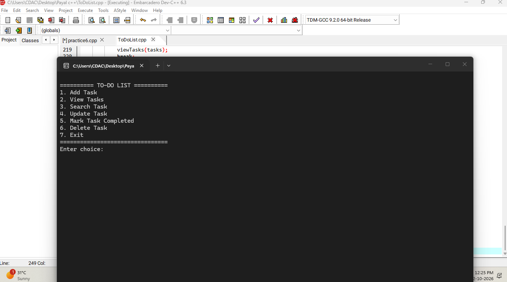
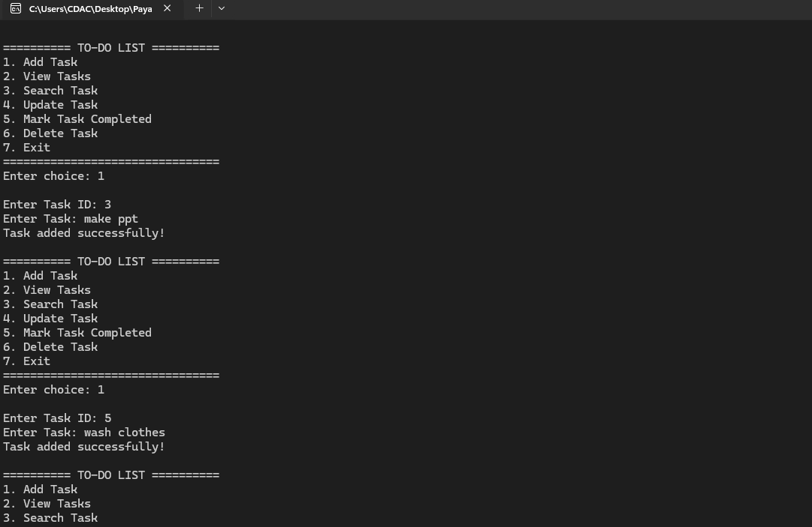
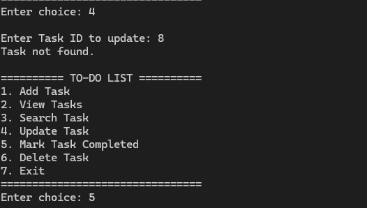
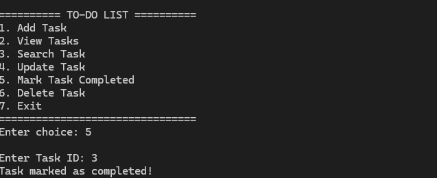
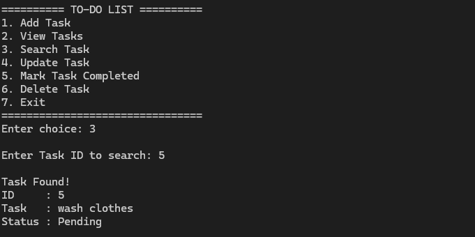

# To-Do List C++ Project

## Description

A simple console-based To-Do List application developed using C++.

The application allows users to manage their tasks through a menu-driven interface.

## Features

- Add a new task
- View all tasks
- Search for a task
- Update a task
- Mark a task as completed
- Delete a task
- Store tasks using file handling

## Technologies Used

- C++
- Object-Oriented Programming
- File Handling
- Vector

## How to Run

1. Download or clone this repository.
2. Open `ToDoList.cpp` in Dev-C++.
3. Compile and run the program.
4. Use the menu options to manage tasks.

## Screenshots
### Main Menu

### Tasks

### Task Operations

## Project Type

Console-based C++ application.
